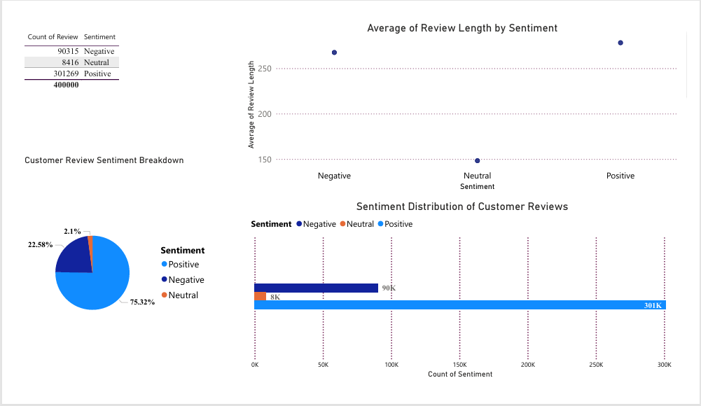

**Author: Lauryn Mwendwa**
**LinkedIn: www.linkedin.com/in/lauryn-mwendwa**

# CUSTOMER SENTIMENT ANALYSIS REPORT
## Introduction
- Customer sentiment analysis is a crucial tool for businesses to understand customer perceptions and improve their services.

- This report analyzes customer reviews from e-commerce platforms or social media to classify sentiments as Positive, Negative, or Neutral using text processing and sentiment analysis.  

- The insights gained from this analysis can help businesses make data-driven decisions to enhance customer satisfaction.  

# Tools Used:
•	**Python (NLTK, TextBlob)** – For text processing and sentiment classification.

•	**Power BI**– For data visualization and trend analysis.

# Sentiment Distribution Overview
*1.	Sentiment Breakdown (Pie Chart)*

•	75.32% of reviews are positive, indicating overall satisfaction.

•	22.58% of reviews are negative, highlighting concerns that businesses should address.

•	2.1% of reviews are neutral, meaning only a small portion of customers had mixed or neutral opinions.

 *Key Takeaway:*
 
 While most reviews are positive, businesses should focus on understanding and reducing negative feedback.

*2.	 Sentiment Distribution (Bar Chart)*
•	Positive reviews (301K) significantly outnumber negative reviews (90K).

•	Neutral reviews (8K) are the least frequent, suggesting that most customers have a clear opinion rather than mixed feelings.  

 *Key Takeaway:*
 
 A strong majority of satisfied customers is a positive sign, but addressing the concerns in negative reviews can further enhance customer experience.

 *Sentiment vs. Review Length*

 
*3.	Average Review Length (Scatter Plot)*

•	Positive reviews tend to be longer (250+ characters), indicating detailed feedback.

•	Negative reviews are shorter, likely due to frustration or brief complaints.

•	Neutral reviews are the shortest (150 characters), suggesting minimal engagement.

 *Key Takeaway:* 
 
 Satisfied customers write more detailed reviews, while negative reviews are often short and to the point.

 
 - Encouraging customers to leave more detailed feedback (even for negatives) can help businesses gain deeper insights.

*4.	Table Interpretation: Sentiment Analysis of Customer Reviews*
•	Majority Positive Reviews
-	75.32% of reviews are positive, indicating that most customers are satisfied with their experience.
-	This suggests strong brand loyalty and high product/service quality.

•	Significant Negative Reviews (22.58%)
-	Though lower than positive reviews, 90K+ negative reviews indicate areas of concern.
-	The business should analyze common themes in these reviews to address recurring issues.

•	Minimal Neutral Reviews (2.1%)
-	The low percentage of neutral reviews suggests that customers generally have strong opinions (either positive or negative) rather than mixed feelings.
-	Encouraging more constructive feedback from neutral customers may provide additional insights into areas of improvement.

  
*Key Takeaways:*
Strong customer satisfaction overall, with 3 out of 4 reviews being positive.

 # Actionable Insights for Businesses
1.	Monitor Negative Reviews – Identify recurring complaints and take corrective action.
2.	Leverage Positive Reviews – Use detailed positive reviews in marketing strategies.
3.	Encourage More Feedback – Request detailed responses from all customers to gather richer insights.
4.	Improve Customer Experience – Address frequent pain points mentioned in negative reviews.

 # Conclusion
This analysis highlights that most customers are satisfied, but businesses must address negative feedback strategically. 

By improving response strategies and acting on complaints, businesses can enhance customer retention and overall brand reputation.

